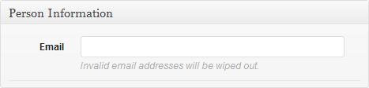

This library contains a couple of hooks that make it possible for you to create and properly save your own field types:

* `cmb2_render_{field-type}`
* `cmb2_sanitize_{field-type}`

You can add actions and filters to these hooks (using WordPress's native `add_action()` and `add_filter()` functions) that enable the custom field types.

## Example 1: Email field

> **This field is included [in CMB2](https://github.com/WebDevStudios/CMB2/blob/master/example-functions.php#L108-L114), so consider this tutorial simply an example.**

A good example would be a `text_email` field that only allowed users to enter a valid email address.



### Step 1: `cmb2_render_{field-type}`
The first step is to write the code for *rendering the field* within the WordPress administrative area:

```php
function cmb2_render_callback_for_text_email( $field, $escaped_value, $object_id, $object_type, $field_type_object ) {
	echo $field_type_object->input( array( 'type' => 'email' ) );
}
add_action( 'cmb2_render_text_email', 'cmb2_render_callback_for_text_email', 10, 5 );
```

This snippet has a few things going on:

* `cmb2_render_text_email` -- By adding an action to this hook, we are essentially creating the new field type. This action defines what code gets executed when you add the `text_email` field type in your field configuration. This first parameter, the hook name, must be `cmb2_render_` followed by the field type name.
* `cmb2_render_callback_for_text_email` -- This is the name of your custom function that gets executed when you use the `text_email` field type. It can be called whatever you want, but it must match a function you define elsewhere in your code.
* `10` -- This is the priority for this action, the order in which it is executed. 10 should be your default unles you have a very good reason for changing it.
* `5` -- This is the number of arguments your custom function will receive. It is required to specify the priority parameter as well as this parameter if you want the callback function to receive more than 1 argument (which is the default). This hook can pass up to 5 arguments:
	* `$field`: The current `CMB2_Field` object.
	* `$escaped_value`: The value of this field passed through the escaping filter. It defaults to `sanitize_text_field`. **If you need the unescaped value, you can access it via `$field_type_object->value()`**.
	* `$object_id`: The id of the object you are working with. Most commonly, the post id.
	* `$object_type`: The type of object you are working with. Most commonly, `post` (this applies to all post-types), but could also be `comment`, `user` or `options-page`.
	* `$field_type_object`: This is an instance of the `CMB2_Types` object and gives you access to all of the methods that CMB2 uses to build its field types.

	We needed to request 5 arguments so that we could access the `$field_type_object` argument in particular. This allows us to use CMB2's built in input method.

In this example, our custom field type will display a normal CMB2 input box, but with a `type` attribute of `email`. It will display the value previously specified for the field, if there is one, and generally work the same as any other CMB2 `text*` fields.

### Step 2: `cmb2_sanitize_{field-type}`
You can optionally add code that sanitizes or modifies the entered value before it is saved. In our example, we only want to allow valid email addresses; we can remove any invalid values before they are saved to the database.

**Note:** in most modern browsers, the field will not be allowed to submit if using the `email` attribute and the value is not an email, but we're including the sanitization filter as a fallback for older browsers.

```php
function cmb2_sanitize_text_email_callback( $override_value, $value ) {
	// not an email?
	if ( ! is_email( $value ) ) {
		// Empty the value
		$value = '';
	}
	return $value;
}
add_filter( 'cmb2_sanitize_text_email', 'cmb2_sanitize_text_email_callback', 10, 2 );
```

What's going on:

* `cmb2_sanitize_text_email` -- This filter defines what code gets executed when the user attempts to save a value in a field type called `text_email` in the library. This first parameter, the hook name, must be `cmb2_sanitize_` followed by the field type name.
* `cmb2_sanitize_text_email_callback` -- This is the name of your custom function that gets executed when the user attempts to save a value in a field type called `text_email`. It can be called whatever you want, but it must match a function you define elsewhere in your code.

The `cmb2_sanitize_{field-type}` hook can pass up to 5 arguments:
* `$override_value`: Sanitization override value to return. It is passed in as `null`, and is what we will modify to short-circuit CMB2's saving mechanism.
* `$value`: The actual field value.
* `$object_id`: The id of the object you are working with. Most commonly, the post id.
* `$field_args`: The field arguments.
* `$sanitizer_object`: This is an instance of the `CMB2_Sanitize` object and gives you access to all of the methods that CMB2 uses to sanitize its field values.

When the user attempts to save a value in the field, we will check if the new value is a valid email address. If not, we will set it as empty. We will then return the possibly-modified value back to the library to do the saving.

### Step 3: Use the field type

With the action (and optionally the filter) added, we can now use the field type in our code just like we would use the built-in field types.

```php
function cmb2_text_email_metabox( $meta_boxes ) {
	$meta_boxes[] = array(
		'id'           => 'cmb2_text_email_metabox',
		'title'        => 'Person Information',
		'object_types' => array( 'post' ),
		'fields'       => array(
			array(
				'name' => 'Email',
				'id'   => '_cmb2_person_email',
				'type' => 'text_email',
				'desc' => 'Invalid email addresses will be wiped out.',
			),
		),
	);
	return $meta_boxes;
}
add_filter( 'cmb2_meta_boxes', 'cmb2_text_email_metabox' );
```


## Example 2: Posts (or other post_type) Dropdown, store post_id

For the times when you need to relate one post to another, this comes in handy.

Like the terms field above, we would pass an array of posts to the `select` field type. First we'll create a function to pull back an array of post options:

```php
/**
 * Gets a number of posts and displays them as options
 * @param  array $query_args Optional. Overrides defaults.
 * @return array             An array of options that matches the CMB2 options array
 */
function cmb2_get_post_options( $query_args ) {

	$args = wp_parse_args( $query_args, array(
		'post_type'   => 'post',
		'numberposts' => 10,
	) );

	$posts = get_posts( $args );

	$post_options = array();
	if ( $posts ) {
		foreach ( $posts as $post ) {
          $post_options[ $post->ID ] = $post->post_title;
		}
	}

	return $post_options;
}
```
Then, in our fields array, we would add the `select` type and pass the `cmb2_get_post_options` function as our 'options' array.

```php
...
        'fields' => array(
			array(
				'name'    => __( 'Select Posts', 'cmb2' ),
				'desc'    => __( 'field description (optional)', 'cmb2' ),
				'id'      => $prefix . 'post_multicheckbox',
				'type'    => 'multicheck',
				'options' => cmb2_get_post_options( array( 'post_type' => 'your_post_type', 'numberposts' => 5 ) ),
			),
        )
...

```
**Alternatively**, you could use the `multicheck`, or `radio` field types as well.

if you're looking for a similar solution for saving a term_id (or term_ids), [read about it on the Tips & Trips page](https://github.com/WebDevStudios/CMB2/wiki/Tips-&-Tricks#a-dropdown-for-taxonomy-terms-which-does-not-set-the-term-on-the-post).

## Example 4: Multiple Inputs, One Field. Let's Create an Address Field.

You may want to create your own field type that stores multiple inputs. Here's how you could create an address field type:

```php
/**
 * Render Address Field
 */
function cmb2_render_address_field_callback( $field_object, $value, $object_id, $object_type, $field_type_object ) {

	// make sure we specify each part of the value we need.
	$value = wp_parse_args( $value, array(
		'address-1' => '',
		'address-2' => '',
		'city'      => '',
		'state'     => '',
		'zip'       => '',
	) );

	?>
	<div><p><label for="<?php echo $field_type_object->_id( '_address_1' ); ?>">Address 1</label></p>
		<?php echo $field_type_object->input( array(
			'name'  => $field_type_object->_name( '[address-1]' ),
			'id'    => $field_type_object->_id( '_address_1' ),
			'value' => $value['address-1'],
		) ); ?>
	</div>
	<div><p><label for="<?php echo $field_type_object->_id( '_address_2' ); ?>'">Address 2</label></p>
		<?php echo $field_type_object->input( array(
			'name'  => $field_type_object->_name( '[address-2]' ),
			'id'    => $field_type_object->_id( '_address_2' ),
			'value' => $value['address-2'],
		) ); ?>
	</div>
	<div class="alignleft"><p><label for="<?php echo $field_type_object->_id( '_city' ); ?>'">City</label></p>
		<?php echo $field_type_object->input( array(
			'class' => 'cmb_text_small',
			'name'  => $field_type_object->_name( '[city]' ),
			'id'    => $field_type_object->_id( '_city' ),
			'value' => $value['city'],
		) ); ?>
	</div>
	<div class="alignleft"><p><label for="<?php echo $field_type_object->_id( '_state' ); ?>'">State</label></p>
		<?php echo $field_type_object->select( array(
			'name'    => $field_type_object->_name( '[state]' ),
			'id'      => $field_type_object->_id( '_state' ),
			'options' => cmb2_get_state_options( $value['state'] )
		) ); ?>
	</div>
	<div class="alignleft"><p><label for="<?php echo $field_type_object->_id( '_zip' ); ?>'">Zip</label></p>
		<?php echo $field_type_object->input( array(
			'class' => 'cmb_text_small',
			'name'  => $field_type_object->_name( '[zip]' ),
			'id'    => $field_type_object->_id( '_zip' ),
			'value' => $value['zip'],
			'type'  => 'number',
		) ); ?>
	</div>
	<?php
	echo $field_type_object->_desc( true );

}
add_filter( 'cmb2_render_address', 'cmb2_render_address_field_callback', 10, 5 );
```
If you use the built-in `$field_type_object` field-type functionality, it is much more likely your custom field type will work with other CMB2 features, and often can save you some hassle.

If you wanted to display this address in your theme or plugin, you could do it like:

```php
$post_id = get_the_ID();
$address = get_post_meta( $post_id, $prefix . 'address', 1 );

// Set default values for each address key
$address = wp_parse_args( $address, array(
	'address-1' => '',
	'address-2' => '',
	'city'      => '',
	'state'     => '',
	'zip'       => '',
) );

?>
<p><strong>Address:</strong> <?php echo esc_html( $address['address-1'] ); ?></p>
<?php if ( $address['address-2'] ) : ?>
	<p><strong>Address 2:</strong> <?php echo esc_html( $address['address-2'] ); ?></p>
<?php endif; ?>
<p><strong>City:</strong> <?php echo esc_html( $address['city'] ); ?></p>
<p><strong>State:</strong> <?php echo esc_html( $address['state'] ); ?></p>
<p><strong>Zip:</strong> <?php echo esc_html( $address['zip'] ); ?></p>
<?php

```
**Note:** It was asked how to make this field repeatable. It's [not impossible, but it's also not super simple](https://github.com/WebDevStudios/CMB2/issues/116#issuecomment-66845137).

## Add Your Own Examples

The possibilities are endless. If you create custom field types that you think others would find useful, please share them here!

### text_number - adds a text number input

Sometimes you only want a number in your input.

```php
// render numbers
add_action( 'cmb2_render_text_number', 'sm_cmb_render_text_number', 10, 5 );
function sm_cmb_render_text_number( $field, $escaped_value, $object_id, $object_type, $field_type_object ) {
	echo $field_type_object->input( array( 'class' => 'cmb2-text-small', 'type' => 'number' ) );
}

// sanitize the field
add_filter( 'cmb2_sanitize_text_number', 'sm_cmb2_sanitize_text_number', 10, 2 );
function sm_cmb2_sanitize_text_number( $null, $new ) {
	$new = preg_replace( "/[^0-9]/", "", $new );

	return $new;
}
```

_____
**Autocomplete type removed as it did not work during testing.**