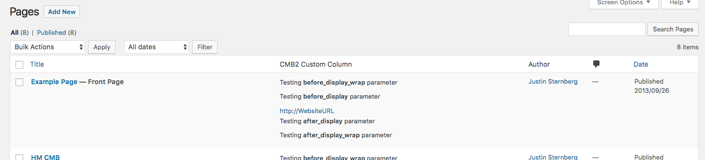

<!-- START doctoc generated TOC please keep comment here to allow auto update -->
<!-- DON'T EDIT THIS SECTION, INSTEAD RE-RUN doctoc TO UPDATE -->
**Table of Contents**  *generated with [DocToc](https://github.com/thlorenz/doctoc)*

- [`name`](#name)
- [`desc`](#desc)
- [`id`](#id)
- [`type`](#type)
- [`repeatable`](#repeatable)
- [`default`](#default)
- [`show_names`](#show_names)
- [`row_classes`](#row_classes)
- [`on_front`](#on_front)
- [`attributes`](#attributes)
- [`before`, `after`, `before_row`, `after_row`, `before_field`, `after_field`](#before-after-before_row-after_row-before_field-after_field)
- [`before_group`, `after_group`, `before_group_row`, `after_group_row`](#before_group-after_group-before_group_row-after_group_row)
- [`before_display_wrap`, `before_display`, `after_display`, `after_display_wrap`](#before_display_wrap-before_display-after_display-after_display_wrap)
- [`column`](#column)
- [`show_on_cb`](#show_on_cb)
- [`options`](#options)
- [`options_cb`](#options_cb)
- [`sanitization_cb`](#sanitization_cb)
- [`escape_cb`](#escape_cb)
- [`render_row_cb`](#render_row_cb)
- [`display_cb`](#display_cb)

<!-- END doctoc generated TOC please keep comment here to allow auto update -->

Most (if not all) fields support the parameters on this page. When a field type supports extra parameters, those parameters are [documented with the given field type](/WebDevStudios/CMB2/wiki/Field-Types). Also, please review the [example-functions.php](https://github.com/WebDevStudios/CMB2/blob/master/example-functions.php) file for examples/demonstration.

### `name`
____
The field label

> `'name' => 'First Name',`

### `desc`
____
Field description. Usually under or adjacent to the field input.
> `'desc' => 'Please enter your first name.',`

### `id`
____
The data key. If using for posts, will be the post-meta key. If using for an options page, will be the array key. **Required**.
> `'id' => 'yourprefix_first_name',`

### `type`
____
What makes the whole thing work. **Required**.
> `'type' => 'text_medium',`

### `repeatable`
____
[Supported by most field types](https://github.com/WebDevStudios/CMB2/wiki/Field-Types#types), and will make the individual field a repeatable one. Default is `false`.
> `'repeatable' => true,`

### `default`
____
Specify a default value for the field.
> `'default' => 'John',`

### `show_names`
____
Whether to show the label for the field. Default is `true`.
> `'show_names' => false,`

### `row_classes`
____
This parameter allows you to add additional classes to the cmb-row wrap. This parameter can take a string, or array, or can take a callback that returns a string or array. Like above, the callback will receive `$field_args` as the first argument, and the CMB2_Field `$field` object as the second argument.
> `'row_classes' => 'additional-class',`

### `on_front`
____
If you're planning on using your metabox fields on the front-end as well (user-facing), then you can specify that certain fields do not get displayed there by setting this parameter to `false`. Default is `true`.
> `'on_front' => false,`

### `attributes`
____
Will modify default attributes (class, input type, rows, etc), or add your own (placeholder, data attributes). Example:

```php
$cmb->add_field( array(
	'name'        => 'Extra Small Textarea',
	'id'          => 'wiki_test_xtra_small_textarea',
	'type'        => 'textarea_small',
	'attributes'  => array(
		'placeholder' => 'A small amount of text',
		'rows'        => 3,
		'required'    => 'required',
	),
) );
```

<a name="attribute-example-2"></a>
Another example which uses html5 attributes to validate that an input's value is greater than 100.

```php
$cmb_demo->add_field( array(
	'name'       => 'Insert a number greater than 100',
	'id'         => 'greater_than_100',
	'type'       => 'text',
	'attributes' => array(
		'type' => 'number',
		'min'  => '101',
	),
) );
```

### `before`, `after`, `before_row`, `after_row`, `before_field`, `after_field`
____
These allow you to add arbitrary text/markup at different points in the field markup. These also accept a callback. The callback will receive `$field_args` as the first argument, and the CMB2_Field `$field` object as the second argument. Example:

```php
$cmb->add_field( array(
	'name'      => 'Test After Row Callback',
	'id'        => 'wiki_test_text',
	'type'      => 'text',
	'after_row' => 'cmb_after_row_cb',
) );

...

/**
 * Output a message if the current page has the id of "2" (the about page)
 * @param  object $field_args Current field args
 * @param  object $field      Current field object
 */
function cmb_after_row_cb( $field_args, $field ) {
	if ( 2 === $field->object_id ) {
		echo 'This is the "About" page!';
	}
}
```

### `before_group`, `after_group`, `before_group_row`, `after_group_row`
____
Like the [`before`, `after`, `before_row`, `after_row`, `before_field`, `after_field`](#before-after-before_row-after_row-before_field-after_field) parameters, but applies specifically to the `'group'` field type. Example:

```php
$group_field_id = $cmb_group->add_field( array(
	'id'               => 'wiki_group_field',
	'type'             => 'group',
	'description'      => 'Generates reusable form entries',
	'before_group'     => '<p>Testing <b>"before_group"</b> parameter</p>',
	'after_group'      => '<p>Testing <b>"after_group"</b> parameter</p>',
	'before_group_row' => '<p>Testing <b>"before_group_row"</b> parameter</p>',
	'after_group_row'  => '<p>Testing <b>"after_group_row"</b> parameter</p>',
) );
```

### `before_display_wrap`, `before_display`, `after_display`, `after_display_wrap`
____
Like the [`before`, `after`, `before_row`, `after_row`, `before_field`, `after_field`](#before-after-before_row-after_row-before_field-after_field) parameters, but applies specifically to the display context (like in admin columns). Example:

```php
$cmb_demo->add_field( array(
	'name'                => 'Test Text',
	'desc'                => 'field description (optional)',
	'id'                  => 'wiki_text',
	'type'                => 'text',
	'column'              => true, // Display field value in the admin post-listing columns
	'before_display_wrap' => '<p>Testing <b>before_display_wrap</b> parameter</p>',
	'before_display'      => '<p>Testing <b>before_display</b> parameter</p>',
	'after_display'       => '<p>Testing <b>after_display</b> parameter</p>',
	'after_display_wrap'  => '<p>Testing <b>after_display_wrap</b> parameter</p>'
) );
```

[](images/testing-display-parameters.png)

### `column`

As of version [2.2.2](https://github.com/WebDevStudios/CMB2/releases/tag/v2.2.2), you can now set admin post-listing columns with an extra field parameter, `'column' => true,`. If you want to dictate what position the column is, use `'column' => array( 'position' => 2 ),`. If you want to dictate the column title (instead of using the field `'name'` value), use `'column' => array( 'name' => 'My Column' ),`. If you need to specify the column display callback, set the `'display_cb'` parameter to [a callback function](#display_cb). Columns work for post (all post-types), comment, user, and term object types.

```php
$cmb_demo->add_field( array(
	'name'   => 'Test Text',
	'desc'   => 'field description (optional)',
	'id'     => 'wiki_text',
	'type'   => 'text',
	'column' => array(
		'position' => 2,
		'name'     => 'CMB2 Custom Column',
	),
) );
```

[](images/field-columns.png?version=2)

### `show_on_cb`
____
A callback to conditionally display a field. Callback function should return a boolean (true/false) value. Function passes in the current field object. Example:

```php
$cmb->add_field( array(
	'name'       => 'Test Text',
	'id'         => 'wiki_test_text',
	'type'       => 'text',
	'show_on_cb' => 'cmb_only_show_for_user_1', // function should return a bool value
) );

...

/**
 * Only display a field if the current user is 1
 * @param  object $field Current field object
 * @return bool          True if current user's ID is 1
 */
function cmb_only_show_for_user_1( $field ) {
	// Returns true if current user's ID is 1, else false
	return 1 === get_current_user_id();
}
```

### `options`
____
For fields that take an options array. These include `select`, `radio`, `multicheck`, `wysiwyg` and `group`. Should be a an array where the keys are the option value, and the values are the option text.
> ```
> 'options' => array(
> 	'none'     => 'None',
> 	'standard' => 'Standard',
> 	'custom'   => 'Custom',
> ),
> ```

### `options_cb`
____
A callback to provide field options. Callback function should return an options array. The callback function gets passed the `$field` object. Example:

```php
$cmb->add_field( array(
	'name'       => 'Select Color',
	'id'         => 'wiki_test_color',
	'type'       => 'multicheck',
	'options_cb' => 'cmb_color_options',
) );

...

/**
 * Display different options depending on post category
 * @param  object $field      Current field object
 * @return array              Array of field options
 */
function cmb_color_options( $field ) {
	$options = array(
		'sapphire' => 'Sapphire Blue',
		'sky'      => 'Sky Blue',
		'navy'     => 'Navy Blue',
		'ruby'     => 'Ruby Red',
		'purple'   => 'Amethyst Purple',
	);

	// If in the 'blue' category, only show blue options.
	if ( has_category( 'blue', $field->object_id ) ) {
		$options = array(
			'sapphire' => 'Sapphire Blue',
			'sky'      => 'Sky Blue',
			'navy'     => 'Navy Blue',
		);
	}

	return $options;
}
```

### `sanitization_cb`
____
Bypass the CMB sanitization (sanitizes before saving) methods with your own callback. Set to `false` if you do not want any sanitization (not recommended).

```php
$cmb->add_field( array(
	'name'            => 'Test Text',
	'id'              => 'wiki_custom_escaping_and_sanitization',
	'type'            => 'text',
	'sanitization_cb' => 'sanitize_greater_than_100', // function should return a sanitized value
	'escape_cb'       => 'escape_greater_than_100', // function should return a sanitized value
) );

...

/**
 * Handles sanitization for the wiki_custom_escaping_and_sanitization field.
 * Ensures a field's value is greater than 100 or nothing.
 *
 * @param  mixed      $value      The unsanitized value from the form.
 * @param  array      $field_args Array of field arguments.
 * @param  CMB2_Field $field      The field object
 *
 * @return mixed                  Sanitized value to be stored.
 */
function sanitize_greater_than_100( $value, $field_args, $field ) {

	/*
	 * This is the default sanitization method for most field types
	 * It handles sanitization for array values, in the case of repeatable fields.
	 */
	// $sanitized_value = is_array( $this->value ) ? array_map( 'sanitize_text_field', $this->value ) : sanitize_text_field( $this->value );

	// Don't keep anything that's less than 100!
	if ( ! is_numeric( $value ) || $value < 101 ) {
		$sanitized_value = '';
	} else {
		// Ok, let's clean it up.
		$sanitized_value = absint( $sanitized_value );
	}

	return $sanitized_value;
}
```

**Note:** To validate that a number is greater than 100 BEFORE saving the field, check out [`the 2nd attributes example`](#attribute-example-2).

### `escape_cb`
____
Bypass the CMB escaping (escapes before display) methods with your own callback. Set to `false` if you do not want any escaping (not recommended).

To use the example from [`sanitization_cb`](#sanitization_cb), we could add an escape callback like:

```php
/**
 * Handles escaping for the wiki_custom_escaping_and_sanitization field for display.
 * Ensures a field's value is greater than 100 or nothing.
 *
 * @param  mixed      $value      The unescaped value from the database.
 * @param  array      $field_args Array of field arguments.
 * @param  CMB2_Field $field      The field object
 *
 * @return mixed                  Escaped value to be displayed.
 */
function escape_greater_than_100( $value, $field_args, $field ) {

	/*
	 * `esc_attr()` is the default escaping for most field types.
	 */
	// $escaped_value = is_array( $this->value ) ? array_map( 'esc_attr', $this->value ) : esc_attr( $this->value );

	// Don't keep anything that's less than 100!
	if ( ! is_numeric( $value ) || $value < 101 ) {
		$escaped_value = '';
	} else {
		// Ok, let's clean it up.
		$escaped_value = absint( $sanitized_value );
	}

	return $escaped_value;
}
```

### `render_row_cb`
____
Bypass the CMB row rendering. You will be completely responsible for outputting that row's html. The callback function gets passed the field `$args` array, and the `$field` object. [More info](https://github.com/WebDevStudios/CMB2/issues/596#issuecomment-187941343).

```php
$cmb->add_field( array(
	'name' => 'Test render_row_cb (manaully rendered)',
	'desc' => 'field description (optional)',
	'id'   => 'wiki_testrender_row_cb',
	'type' => 'text',
	'render_row_cb' => 'cmb_test_render_row_cb',
) );

...

/**
 * Manually render a field.
 *
 * @param  array      $field_args Array of field arguments.
 * @param  CMB2_Field $field      The field object
 */
function cmb_test_render_row_cb( $field_args, $field ) {
	$id          = $field->args( 'id' );
	$label       = $field->args( 'name' );
	$name        = $field->args( '_name' );
	$value       = $field->escaped_value();
	$description = $field->args( 'description' );
	?>
	<div class="custom-field-row">
		<p><label for="<?php echo $id; ?>"><?php echo $label; ?></label></p>
		<p><input id="<?php echo $id; ?>" type="text" name="<?php echo $name; ?>" value="<?php echo $value; ?>"/></p>
		<p class="description"><?php echo $description; ?></p>
	</div>
	<?php
}
```

### `display_cb`
____
With the addition of optional columns display output in [2.2.2](https://github.com/WebDevStudios/CMB2/releases/tag/v2.2.2), You can now set the field's `'display_cb'` to dictate how that field value should be displayed.

```php
$cmb_demo->add_field( array(
	'name'       => 'Test Text',
	'desc'       => 'field description (optional)',
	'id'         => 'wiki_text',
	'type'       => 'text',
	'column'     => true,
	'display_cb' => 'yourprefix_display_wiki_text', // Output the display of the column values through a callback.
) );

...

/**
 * Manually render a field column display.
 *
 * @param  array      $field_args Array of field arguments.
 * @param  CMB2_Field $field      The field object
 */
function yourprefix_display_wiki_text( $field_args, $field ) {
	?>
	<div class="custom-column-display <?php echo $field->row_classes(); ?>">
		<p><?php echo $field->escaped_value(); ?></p>
		<p class="description"><?php echo $field->args( 'description' ); ?></p>
	</div>
	<?php
}
```
