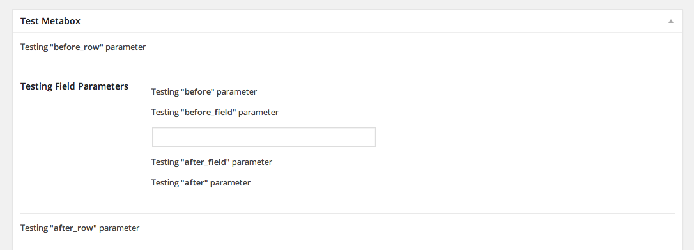
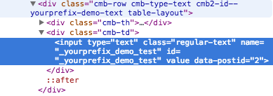

<!-- START doctoc generated TOC please keep comment here to allow auto update -->
<!-- DON'T EDIT THIS SECTION, INSTEAD RE-RUN doctoc TO UPDATE -->
**Table of Contents**  *generated with [DocToc](https://github.com/thlorenz/doctoc)*

- [Override text strings in field](#override-text-strings-in-field)
- [Inject static content in a field](#inject-static-content-in-a-field)
- [Inject dynamic content in a field via a callback](#inject-dynamic-content-in-a-field-via-a-callback)
- [Using the dynamic before/after form hooks](#using-the-dynamic-beforeafter-form-hooks)
- [Setting a metabox to 'closed' by default](#setting-a-metabox-to-closed-by-default)
- [Using CMB2 helper functions and cmb2_init](#using-cmb2-helper-functions-and-cmb2_init)
- [Setting a default value for a checkbox](#setting-a-default-value-for-a-checkbox)
- [A dropdown for taxonomy terms which does NOT set the term on the post](#a-dropdown-for-taxonomy-terms-which-does-not-set-the-term-on-the-post)
- [Setting a default field value via a callback](#setting-a-default-field-value-via-a-callback)
- [Setting dynamic attributes that may use post data, like the post ID](#setting-dynamic-attributes-that-may-use-post-data-like-the-post-id)
- [Modify Field Label Output](#modify-field-label-output)
- [Change the year range for the date field types](#change-the-year-range-for-the-date-field-types)
- [Modify Field Row Output and Markup](#modify-field-row-output-and-markup)

<!-- END doctoc generated TOC please keep comment here to allow auto update -->
___
## Override text strings in field

Several of the CMB2 field types have text strings in them, and CMB2 provides a way to override each of them.
The `file` field type has a button with the text, "Add or Upload File." Here is how you would override that text during your field configuration:

```php
$cmb->add_field( array(
	'name'    => 'PDF',
	'id'      => $prefix . 'pdf',
	'type'    => 'file',
	'options' => array(
		'add_upload_file_text' => 'Upload PDF',
	),
) );
```

To find a particular string, search for it in the [`CMB2_Types` class](https://github.com/WebDevStudios/CMB2/blob/master/includes/CMB2_Types.php), or search for `'$this->_text('`. The first parameter passed to the `CMB2_Types::_text()` method is the key you will use in the field options parameter array.

## Inject static content in a field

There are several field properties you can use to inject text or content in your fields. These parameters are:

* before_field
* before_row
* before
* after
* after_row
* after_field

To use them in your field, it would look something like this:

```php
$cmb->add_field( array(
	'name'         => 'Testing Field Parameters',
	'id'           => $prefix . 'test_parameters',
	'type'         => 'text',
	'before_row'   => '<p>Testing <b>"before_row"</b> parameter</p>',
	'before'       => '<p>Testing <b>"before"</b> parameter</p>',
	'before_field' => '<p>Testing <b>"before_field"</b> parameter</p>',
	'after_field'  => '<p>Testing <b>"after_field"</b> parameter</p>',
	'after'        => '<p>Testing <b>"after"</b> parameter</p>',
	'after_row'    => '<p>Testing <b>"after_row"</b> parameter</p>',
) );
```
And that field would look like:


## Inject dynamic content in a field via a callback

Those same parameters can accept a callback to be called at runtime, and get passed two parameters, `$field_args` and `$field`. The `$field` object will have some handy parameters to help us add some conditional logic to our callbacks.

Let's say, for example, that you only want to show text in front of your field if the `$post_id` is 2. First you will need to create your callback function:

```php
/**
 * Conditionally displays a message if the $post_id is 2
 *
 * @param  array             $field_args Array of field parameters
 * @param  CMB2_Field object $field      Field object
 */
function cmb2_before_row_if_2( $field_args, $field ) {
	if ( 2 == $field->object_id ) {
		echo '<p>Testing <b>"before_row"</b> parameter (on $post_id 2)</p>';
	} else {
		echo '<p>Testing <b>"before_row"</b> parameter (<b>NOT</b> on $post_id 2)</p>';
	}
}

```

Then you can specifiy that callback in your field parameter:

```php
$cmb->add_field( array(
	'name'       => 'Testing Field Parameters',
	'id'         => $prefix . 'test_parameters',
	'type'       => 'text',
	'before_row' => 'cmb2_before_row_if_2', // callback
) );
```

## Using the dynamic before/after form hooks

If we wanted to hook in before or after our `test_metabox` metabox form from [example-functions.php](https://github.com/WebDevStudios/CMB2/blob/master/example-functions.php), our best option would be to use the dynamic action hooks. If you look in the source code, you will see this hook before the form begins:

```php
do_action( "cmb2_before_{$object_type}_form_{$this->cmb_id}", $object_id, $this );
```
and this hook after the form:
```php
do_action( "cmb2_after_{$object_type}_form_{$this->cmb_id}", $object_id, $this );
```

The first dynamic portion of the hook name, $object_type, is the type of object you are working with. Usually `post` (this applies to all post-types). This could also be `comment`, `user` or `options-page`.

The second dynamic portion of the hook name, `$this->cmb_id`, is the meta_box id.

The parameters passed into the hook are:

* `$object_id`: The ID of the current object
* `$cmb`: This CMB2 object

So to accomplish our goal for hooking in before our `test_metabox` metabox form, we would do something like this:

```php
function cmb2_test_before_form() {
	echo 'This is some text before the form.';
}
add_action( 'cmb2_before_post_form_test_metabox', 'cmb2_test_before_form' );
```

If we wanted access to the CMB2 object, we could request 2 parameters when we do our `add_action`:
```php
function cmb2_test_before_form( $post_id, $cmb ) {
	echo $cmb->prop( 'title' );
}
add_action( 'cmb2_before_post_form_test_metabox', 'cmb2_test_before_form', 10, 2 );
```

## Setting a metabox to 'closed' by default

If you prefer a particular metabox to be closed by default, you can do it via the `closed` metabox parameter:

```php
$cmb = new_cmb2_box( array(
	'id'           => 'test_metabox',
	'title'        => __( 'Test Metabox', 'cmb2' ),
	'object_types' => array( 'page', ),
	'closed'       => true, // true to keep the metabox closed by default
) );
```

## Using CMB2 helper functions and cmb2_init

Since CMB2 init is included/setup on init, the CMB2 helper functions will not be available until then. Rather than trying to determine which hook priority CMB2 is loaded on init, you can use the 'cmb2_init' hook ('cmb2_admin_init' if you're working in the admin). This is the earliest hook where you can safely use the CMB2 helper functions.

```php
function cmb2_init_check_field_value() {
	$radio_value = cmb2_get_field_value( 'test_metabox', '_cmb2_test_radio', get_queried_object_id() );

	// Perform additional logic based on $radio_value
}
add_action( 'cmb2_init', 'cmb2_init_check_field_value' );
```

## Setting a default value for a checkbox

Setting a default value for a checkbox is tricky. A checkbox is basically an on/off (empty) value.. So if you set a default for 'on', and they set it to 'off' (which toggles it to empty again), the default will kick in (default is 'on', remember?). You now have a checkbox which can only have a value of 'on'.

One way to get around that is to only set your default if you're on the `post-new` screen. Then, once the post is saved, the default no longer applies. How can we accomplish that? With a simple function like:

```php
/**
 * Only return default value if we don't have a post ID (in the 'post' query variable)
 *
 * @param  bool  $default On/Off (true/false)
 * @return mixed          Returns true or '', the blank default
 */
function cmb2_set_checkbox_default_for_new_post( $default ) {
	return isset( $_GET['post'] ) ? '' : ( $default ? (string) $default : '' );
}
```

What this function does is to check if we're on the `post-new` page, and if so, set the default value for the checkbox. It's a little bit silly, because if you pass it `false`, it will operate the exact same as not setting a default at all, but it gets the job done.

If we're NOT on the `post-new` screen, the value `''` will be returned, which again, is the same value if we hadn't set a default at all. This ensures that once they save the post, the value they saved will stick.

To see it in action, here's a sample metabox and field:

```php
function cmb2_checkbox_default_metabox_test() {
	/**
	 * Sample metabox to demonstrate setting a checkbox default value
	 */
	$cmb = new_cmb2_box( array(
		'id' => 'checkbox_default',
		'title'        => 'Set Checkbox Default',
		'object_types' => array( 'post' ),
		'context'      => 'side',
	) );

	$cmb->add_field( array(
		'desc'    => 'Click Me',
		'type'    => 'checkbox',
		'id'      => '_test_checkbox_default',
		'default' => cmb2_set_checkbox_default_for_new_post( true ),
	) );
}
add_action( 'cmb2_admin_init', 'cmb2_checkbox_default_metabox_test' );
```

## A dropdown for taxonomy terms which does NOT set the term on the post

I have often been asked why the `taxonomy_select` field doesn't return a term_id. The reason is that the `taxonomy_select` field is not meant for that purpose. it is meant to set a term for a post and to be a replacement for the built-in WordPress term-setting UI.

However, there are some cases where you may want to save an arbitrary term_id. Maybe you have an options page and want to set the featured category. Or maybe you want to set the featured category for a post. In either of those cases, being able to save a term_id is desireable.

This can be accomplished with the help of a function:

```php
/**
 * Gets a number of terms and displays them as options
 * @param  string       $taxonomy Taxonomy terms to retrieve. Default is category.
 * @param  string|array $args     Optional. get_terms optional arguments
 * @return array                  An array of options that matches the CMB2 options array
 */
function cmb2_get_term_options( $taxonomy = 'category', $args = array() ) {

	$args['taxonomy'] = $taxonomy;
	// $defaults = array( 'taxonomy' => 'category' );
	$args = wp_parse_args( $args, array( 'taxonomy' => 'category' ) );

	$taxonomy = $args['taxonomy'];

	$terms = (array) get_terms( $taxonomy, $args );

	// Initate an empty array
	$term_options = array();
	if ( ! empty( $terms ) ) {
		foreach ( $terms as $term ) {
			$term_options[ $term->term_id ] = $term->name;
		}
	}

	return $term_options;
}
```

Now you can use this function to set the options for a CMB2 `select`, `radio`, or `multicheck` field:

```php
$cmb->add_field( array(
	'name'    => 'Featured Term',
	'desc'    => 'Set a featured term for this post.',
	'id'      => '_cmb2_featured_term',
	'type'    => 'select',
	'options' => cmb2_get_term_options(),
) );
```

## Setting a default field value via a callback

CMB2 fields have a 'default' parameter, but did you know that same parameter can accept a callback? This allows you to use things like the `$field->object_id` (the `$post` ID) to dynamically set your default value.

field config:
```php
$cmb->add_field( array(
	'name'    => __( 'Test', 'cmb2' ),
	'id'      => $prefix . 'test',
	'type'    => 'text',
	'default' => 'prefix_set_test_default',
) );
```

callback:
```php
function prefix_set_test_default( $field_args, $field ) {
	return 'Post ID: '. $field->object_id
}
```
[#256 for reference](https://github.com/WebDevStudios/CMB2/issues/256#issuecomment-84023325)

## Setting dynamic attributes that may use post data, like the post ID

There are [several callback hooks](https://github.com/WebDevStudios/CMB2/wiki/Field-Types#common-field-parameters) in the lifecycle of a field display. These are meant to provide you with a hook to output arbitrary or dynamic data. BUT, you can also use these hooks to modify the `CMB2_Field` `$field` object. In this example, we're going to use a callback on the `'before'` parameter which we'll use to modify that `$field` object's `'attributes'` array. We're going to do this so we can add a custom data attribute with the post ID as the value.

field config:
```php
$cmb->add_field( array(
	'name'   => __( 'Test', 'cmb2' ),
	'id'     => $prefix . 'test',
	'type'   => 'text',
	'before' => 'prefix_set_field_data_attr',
) );
```
callback:
```php
function prefix_set_field_data_attr( $args, $field ) {
	$field->args['attributes']['data-postid'] = $field->object_id;
}
```



[#256 for reference](https://github.com/WebDevStudios/CMB2/issues/256#issuecomment-84023325)

## Modify Field Label Output

In a recent [Github issue](https://github.com/WebDevStudios/CMB2/issues/435) a user asked if they could add tooltips next to the Field label. This snippet doesn't cover the CSS/JS side of things, but documents how you can easily modify the markup to accommodate tooltips, while leveraging some CMB2 methods to store your tooltip data to the field's options parameter.

```php
$cmb->add_field( array(
	'name' => __( 'Test Text Area', 'cmb2' ),
	'id'   => $prefix . 'textarea',
	'type' => 'textarea',
	'label_cb' => 'prefix_add_tooltip_to_label',
	'options' => array(
		'tooltip-class' => 'fa-info-circle',
		'tooltip'       => 'This is info about this setting or field',
	),
) );
```

Then the callback function would look something like this:

```php
function prefix_add_tooltip_to_label( $field_args, $field ) {
	// Get default label
	if ( $label = $field->label() && $field->option( 'tooltip' ) ) {
		// If label and tooltip exists, add it
		$label .= sprintf( '<span class="tip"><i class="fa %s"></i>%s</span>', $field->option( 'tooltip-class' ), $field->option( 'tooltip' ) );
	}

	return $label;
}
```

## Change the year range for the date field types

In this [Github issue](https://github.com/WebDevStudios/CMB2/issues/567) a user asked how to make the year range in the date picker go back further than 2006 (it happens to span 10 years before today and 10 years after). To change that range for a specific field, you would need to add a `'data-datepicker'` data attribute to the field being registered. (This feature was added in version 2.2.0. Previously you would have had to use the `'cmb2_localized_data'` filter to override the defaults for ALL datepicker fields.) This will allow you to override the jQuery datepicker default value for this field with your own range. In this case, I have set the range to start in 1990 and to end 10 years after the current year (using php's date() function).

```php
$cmb_demo->add_field( array(
	'name'       => __( 'Test Date Picker (UNIX timestamp)', 'cmb2' ),
	'id'         => $prefix . 'textdate_timestamp',
	'type'       => 'text_date_timestamp',
	'attributes' => array(
		// CMB2 checks for datepicker override data here:
		'data-datepicker' => json_encode( array(
			'yearRange' => '1990:'. ( date( 'Y' ) + 10 ),
		) ),
	),
) );
```

## Modify Field Row Output and Markup
When adding a field, you can pass a function to the `render_row_cb` option to modify the way a field row is rendered. This is mainly to edit the markup that surrounds each individual field, not to edit the field itself.

```php
$cmb->add_field( array(
    'name' => 'Test Row Field Callback',
    'type' => 'text',
    'id'   => 'wiki_test_row_cb',
    // Add the name of your function to override the default row render method
    'render_row_cb' => 'override_render_field_callback'
) );
```

Passing the name of a function to the `render_row_cb` option provides a callback with the field object and field arguments so you can add additional classes or markup surrounding a wrapped field. 

```php
/**
 * Overrides the default render field method
 * Allows you to add custom HTML before and after a rendered field
 *
 * @param  array             $field_args Array of field parameters
 * @param  CMB2_Field object $field      Field object
 */
function override_render_field_callback( $field_args, $field ) {
    // Ensures that this can only be seen on the admin. Remove if not necessary
    if ( ! is_admin() && ! $field->args( 'on_front' ) ) {
        return;
    }
    // If field is requesting to be conditionally shown
    if ( ! $field->should_show() ) {
        return;
    }

    $field->peform_param_callback( 'before_row' );
    printf( '<div class="cmb-row custom-class %s">', $field->row_classes() );
    if ( ! $field->args( 'show_names' ) ) {
    // If the field is going to show a label output this
        echo '<div class="cmb-td custom-label-class">';
        $field->peform_param_callback( 'label_cb' );
    } else {
    // Otherwise output something different
        if ( $field->get_param_callback_result( 'label_cb', false ) ) {
            echo '<div class="cmb-th custom-label-field-class">', $field->peform_param_callback( 'label_cb' ), '</div>';
        }
        echo '<div class="cmb-td custom-label-field">';
    }
    $field->peform_param_callback( 'before' );
    // The next two lines are key. This is what actually renders the input field
    $field_type = new CMB2_Types( $field );
    $field_type->render();
    $field->peform_param_callback( 'after' );
    echo '</div></div>';
    $field->peform_param_callback( 'after_row' );
    // For chaining
    return $field;
}
```

This example replicates the default render method with custom classes assigned to wrapping divs as an example. When writing your callback function make sure to create an instance of the CMB2_Types class, passing the field object, and calling the function on render() on this instance. This will actually render the fields HTML.